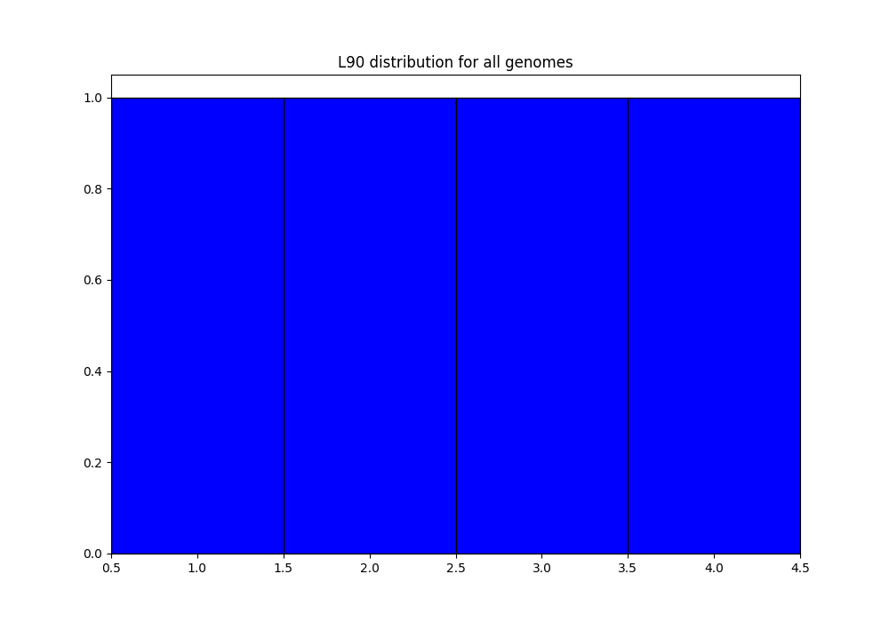

====================
Tutorial on examples
====================

We provide a folder, ``Examples``, containing genomic sequences (in ``Examples/genomes``).

All commands to run all Example steps can be found in ``Examples/commands/``

.. note:: The provided genomic sequences are taken from real genomes, but then modified and shortened in order to have an example showing different situations, but running very quickly. Hence, the example results should not be interpreted biologically!

Genomes description
===================

We provide 4 different fictive genomes:

    - genome1:

        * 1 file, with 1 contig (fasta file) ``genome1.fst``
        * example of complete genome of a bacteria without plasmid. However, there is a stretch of 11 "N" in its sequence. It will then be split into 2 contigs with the default parameters.

    - genome2:

        * 1 file, with 4 contigs (multifasta) ``genome2.fst``
        * example of a draft genome

    - genome3:

        * 2 files

            - ``genome3-chromo.fst`` with 1 contig (fasta)
            - ``genome3-plasmid.fst`` with 1 contig (fasta)

        * example of a complete genome with 1 plasmid. Note that there is a stretch of 6 "N" in the plasmid sequence, so it will be split into 2 contigs with the default parameters.

    - genome4:

        * 1 file, with 1 contig (fasta) ``genome4.fst``
        * example of a complete genome (no stretch of "N" in the sequence)

Annotate step
=============

To annotate genomes, you need to provide a list of genomes to annotate, in a text file. An example, corresponding to the genomes in ``Examples/genomes_init`` is provided in ``Examples/input_files/list_genomes.lst``. Here is its content:

.. code-block:: text

    genome1.fst
    genome2.fst :: GEN2
    genome3-chromo.fst genome3-plasmid.fst :: .1216
    genome4.fst  :: GEN4.1111

You can see that each line contains the filename(s) corresponding to one genome.

For genome2 and genome4, we specify a species name (GEN2 and GEN4 respectively). For genome1 and genome3, we do not specify a name: the default name given to the program (``-n <name>``) will be used to name them.
For genome3 and genome4, we specify a date at which they were downloaded. For genome1 and genome2, we do not specify a date: if a default date is given to the program (``--date <date>``), it will be used for those 2 genomes. Otherwise, the current date will be used.

Quality control
---------------

If you just want to do quality control on the dataset, type::

    PanACoTA annotate -d Examples/genomes_init -l Examples/input_files/list_genomes.lst -r Examples/2-res-QC -Q

This will create a folder ``Examples/2-res-QC``, containing:

- ``QC_L90-list_genomes.png``: histogram of the L90 values of all genomes:

- ``QC_nb-contigs-list_genomes.png``: histogram of number of contigs in all genomes:

- ``discarded-list_genomes.lst``: should be empty. The default limits are :math:`L90 \leq 100` and :math:`nbcontigs \leq 999`. In the png files, we can see that we are very far from those limits, so, no genome is discarded.
- ``PanACoTA-annotate_list_genomes.log``: log file. See information on what happened during the run: traceback of stdout.
- ``PanACoTA-annotate_list_genomes.log.err``: log file but only with Warnings and Errors. If it is empty, everything went well!
- ``PanACoTA-annotate_list_genomes.log.details``: with the quality control only option, this file is exactly the same as the ``.log`` file. It will add details when annotation step is run.
- ``ALL-GENOMES-info-list_genomes.lst``: file with information on each genome: size, number of contigs and L90::

    orig_name                   to_annotate                                    gsize   nb_conts   L90
    genome1.fst                 genome1.fst_prokka-split5N.fna                 9808    2          2
    genome2.fst                 genome2.fst_prokka-split5N.fna                 10717   5          4
    genome3-chromo.fst-all.fna  genome3-chromo.fst-all.fna_prokka-split5N.fna  8817    3          3
    genome4.fst                 genome4.fst_prokka-split5N.fna                 7134    1          1

- ``tmp_files`` folder: For genome3, which contains 2 original files, you can find the concatenation of them in the file ``genome3-chromo.fst-all.fna``. This folder also contains your genomic sequences, split at each stretch of at least 5 'N', in files called ``<whole_genome_filename>-split5N.fna``. You can check that, now:

    * genome1 contains 2 contigs (its original contig contains a stretch of more than 5 ``N``)
    * genome2 contains 5 contigs (the first contig of original file contains a stretch of 5 ``N``)
    * genome3 contains 3 contigs (1 from the chromosome file, and 2 from the plasmid file, which contains a stretch of 6 ``N``)
    * genome4 still contains 1 contig

In the ``QC_L90-list_genomes.png``, we can see that all genomes have a L90 lower or equal to 4. Similarly, in ``QC_nb-contigs-list_genomes.png``, we can see that all genomes have less or equal to 5 contigs. This is consistent with the ``ALL-GENOMES-info-list_genomes.lst`` file.

Annotation: functional (default) or only syntactic
--------------------------------------------------

Now that you have seen the distribution of L90 and #contig values in your genomes, and decided which limits you want to use (if you do not want to use the default ones), you can annotate the genomes which are under those limits with. Here, we only annotate genomes with less than 10 contigs and a maximum of 3 for L90 (meaning that genome2 is removed from analysis):

Functional annotation with Prokka (default)::

    PanACoTA annotate -d Examples/genomes_init -r Examples/2-res-prokka -l Examples/input_files/list_genomes.lst -n GENO --l90 3 --nbcont 10

Only syntactic annotation with Prodigal::

    PanACoTA annotate -d Examples/genomes_init -r Examples/2-res-prodigal -l Examples/input_files/list_genomes.lst -n GENO --l90 3 --nbcont 10 --prodigal

Yes, you should get an error message! Check indicated log files to get more information. Here is what happened:

Prodigal does not accept, by default, sequences smaller than 20000 nucleotides, which is the case in this example. So, to run prodigal on such small sequences, we need to add the ``--small`` option::

    PanACoTA annotate -d Examples/genomes_init -r Examples/2-res-prodigal -l Examples/input_files/list_genomes.lst -n GENO --l90 3 --nbcont 10 --prodigal --small

.. note:: Only use --small option if you need to (if you have really small sequences). But keep in mind that, with so small sequences, annotation will be limited!

.. note:: On sequences with a standard size, prodigal will start training on the best genome, and will then annotate all others based on this trained dataset. This will ensure a faster annotation, and a more homogeneous one, as the model used will be the same for all genomes.

Here, we put the L90 limit to 3, which should lead to the removal of 1 genome (genome2, according to the ``info-genomes-list_genomes.lst``). We also put the nbcont limit to 10. However, this should not remove any genome, as all have less than 10 contigs. We put these limits just to show how the program works with your own limits, but they do not have any significance here, as a genome with L90 = 4 is not a bad quality genome!

We also have to add an option, `-n <name>` to specify the default name to give to the genomes if it is not specified in the list file (here, for genome1 and genome3). We here choose `GENO`, as short for 'genome'... Choose more appropriate names!

In your result directory, you should now have:

- the png files as previously: the distribution of values is the same, but the new limit for L90 now appears as a red line, as it is in the same range as the values:

- ``discarded-list_genomes.lst``: there is now one genome discarded: genome2. In this file, we can indeed see that its L90 is 4 (higher than the limit).
- ``LSTINFO-list_genomes.lst``: get information on the 3 genomes which were annotated. You can check that:

    - genome1 was named using 'GENO' (default name), and the current date (MMYY)
    - genome3 was named using the default value 'GENO', and the date specified in list file (1216)
    - genome4 was named using 'GEN4' (specified in list file) and the date specified in list file (1111)
    - genome2 does not appear as it was discarded because its L90 is higher than the given limit, 3.
- log files as previously. Check in the ``.log.err`` file that no error occurred. Note that if you used the same output directory as for the previous step, and did not remove the log files, the new ones do not erase the existing ones: they now have a timestamp corresponding to the time/date when you launched this annotation step. In the ``.log.details`` file, you now have more details, such as the start and end times of annotation of all genomes.
- in ``tmp_files``, you still have the 'split5N' genomic sequence files, as well as prokka/prodigal result folders.
- You have 5 new folders: ``Replicons``, ``LSTINFO``, ``gff3``, ``Genes``, ``Proteins`` each one containing 3 files (1 per genome) with your results.

PanGenome step
==============

To do a pangenome, you need to provide the list of genomes to consider, with 1 genome per line. Only the first column (genome name) will be considered, but you can use a file containing other columns...such as the one you already have in the result folder of annotation step: ``LSTINFO-list_genomes.lst``! However, of course, if you want to do a pangenome of less genomes than the ones you annotated, you are free to create a new file with the genomes you want.
Here, we are doing a pangenome of the 3 genomes annotated by prokka before. Here is the command line::

    PanACoTA pangenome -l Examples/2-res-prokka/LSTINFO-list_genomes.lst -n GENO3 -d Examples/2-res-prokka/Proteins -i 0.8 -o Examples/3-pangenome

With:

    - ``-l``: list of genomes to take for the pangenome
    - ``-n``: we name this dataset 'GENO3' (for 3 genomes of species 'GENO')
    - ``-d``: path to the folder containing all protein files
    - ``-i``: we want a pangenome with 80% identity
    - ``-o``: put all result and temporary files to this directory

In your ``Examples/3-pangenome`` folder, you should have your pangenome in a file called ``PanGenome-GENO3.All.prt-clust-0.8-mode1_<date>.tsv.lst``. It contains 1 line per family. The first column is the family number, and others are all family members. You also have the qualitative (``.quali.txt``) and quantitative (``.quanti.txt``) matrix of this pangenome, as well as a summary file (``.summary.txt``). See more information on those files in :ref:`output format description<panfile>`.

In your ``Examples/2-res-prokka/Proteins`` folder, you should have a new file, ``GENO3.All.prt``, containing all proteins of the 3 genomes.

If you used the same dataset and parameters as in this file, you should get a pangenome with 14 families.

If you did not run the annotate step, but just want to test the pangenome step, use::

    PanACoTA pangenome -l Examples/input_files/pan-input/LSTINFO-list_genomes.lst -n GENO3 -d Examples/input_files/pan-input/Proteins -i 0.8 -o Examples/3-pangenome

Core/Persistent Genome step
===========================

The core genome is inferred from the pangenome. So, the only required file is your pangenome, obtained at last step. By default, it will generate a core genome. Here is the command line to obtain the core genome of our dataset::

    PanACoTA corepers -p Examples/3-pangenome/PanGenome-GENO3.All.prt-clust-0.8-mode1_<date>.tsv.lst -o Examples/4-corepers

**Replace `<date>` by your real filename**

You now have your core genome (we used the default parameter) in ``Examples/4-corepers/PersGenome_<pangenome-filename>_1.lst``. With ``_1`` meaning that you asked for 100% of genomes present in each family.
If you used the same dataset and parameters as in this file, you should get a core genome with **6 families**.

If you want a persistent genome, specify the required :ref:`options<docorepers>` (minimum percentage of genomes in a family to be considered as persistent, allowing or not multi/mixed families...). For example, for a strict persistent genome at 95%::

    PanACoTA corepers -p Examples/3-pangenome/PanGenome-GENO3.All.prt-clust-0.8-mode1_<date>.tsv.lst -o Examples/4-corepers -t 0.95

The output file will be ``Examples/4-corepers/PersGenome_<pangenome-filename>_0.95.lst``, and will contain the same 6 families (95% of 3 genomes is all genomes).

If you did not run the annotate and pangenome steps, but only want to test the corepers module, run::

    PanACoTA corepers -p Examples/input_files/core-input/PanGenome-example.lst -o Examples/4-corepers

Alignment step
==============

You can then do an alignment of all the proteins of each persistent family. For example, to align the 6 core families found in the previous step::

    PanACoTA align -c Examples/4-corepers/PersGenome_<pangenome-filename>_1.lst -l Examples/2-res-prokka/LSTINFO-list_genomes.lst -n GENO3_1 -d Examples/2-res-prokka -o Examples/5-align

**Replace `PersGenome_<pangenome-filename>_1.lst` by your real persistent genome filename**

with:

    - ``-c``: the core/persistent genome file generated in previous step
    - ``-l``: list of genomes in your dataset (generated by annotation step)
    - ``-n``: we name this dataset 'GENO3-1' (for 3 genomes of species 'GENO', and 100% of the genomes in each family)
    - ``-d``: path to the folder containing the directories 'Proteins' and 'Genes'
    - ``-o``: put all result and temporary files to this directory

optional:

    - ``-F``: force to redo all alignments
    - ``-P``: also provide concatenated protein alignments

In your output directory ``Examples/5-align``, you will find a directory called ``Phylo-GENO3_1``, containing your alignment file: ``GENO3_1.grp.aln``.

See :ref:`here <doalign>` for a description of the other files generated, as well as the options available.

If you did not run the annotate, pan and corepers steps, but just want to test the align module, run::

    PanACoTA align -c Examples/input_files/align-input/coregenome-example.lst -l Examples/input_files/pan-input/LSTINFO-list_genomes.lst -n GENO3_1 -d Examples/input_files/pan-input -o Examples/5-align

Tree step
=========

You can infer a phylogenetic tree from the alignment of persistent families. By default, it uses IQ TREE to infer the phylogenetic tree, with a GTR DNA substitution model, and no bootstrap. To run this on the alignment generated by the previous step, use::

    PanACoTA tree -a Examples/5-align/Phylo-GENO3_1/GENO3_1.grp.aln -o Examples/6-tree

In your output directory, ``Examples/6-tree``, you will find your phylogenetic tree file, called ``GENO3_1.grp.aln.iqtree_tree.treefile``. If you followed all previous steps, your file should contain something close to (can differ a little depending on your version of IQ TREE):

.. code-block:: text

    (GEN4.1111.00001:0.0054333949,GENO.0920.00001:0.0040715866,GENO.1216.00002:0.0045089138);

See the :ref:`tree part of tutorial<dotree>` to get more information on all options available, output files generated, as well as how to use FastTree, FastME or Quicktree instead of IQ TREE to infer the phylogenetic tree.

If you did not run the annotate, pan, corepers and align steps but just want to test the tree module, run::

    PanACoTA tree -a Examples/input_files/tree-input/GENO3_1.nucl.grp.aln -o Examples/6-tree
