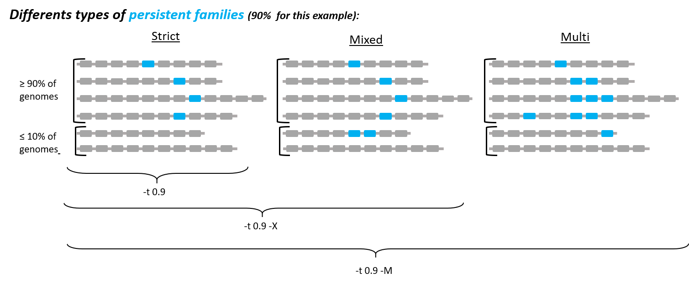
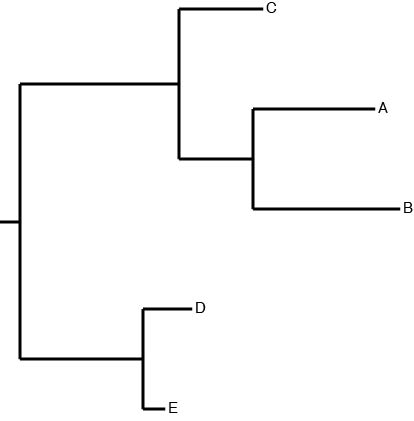

=================================
Running PanACoTA - help by module
=================================

``PanACoTA`` contains 6 subcommands, for the different steps:

    - ``prepare`` (download genomes from refseq if you want to, or give your input database, to run a filtering quality control). To help you find NCBI species taxid you need, you can use their `taxonomy browser <https://www.ncbi.nlm.nih.gov/Taxonomy/Browser/wwwtax.cgi>`_
    - ``annotate`` (annotate all genomes of the dataset, after a quality control)
    - ``pangenome`` (generate pan-genome)
    - ``corepers`` (generate core-genome or persistent-genome)
    - ``align`` (align core/persistent families)
    - ``tree`` (infer phylogenetic tree from persistent genome)

We also provide a subommand ``all`` to run all modules in a row.

You can run each subcommand by typing::

    PanACoTA <subcommand_name> <arguments_for_subcommand>

Each subcommand has its own options and inputs. To get the list of required arguments and other available options for the subcommand you want to run, type::

    PanACoTA <subcommand> -h

General information
===================

Here are the options shared by all subcommands:

    - ``-h`` or ``--help``: show help on subcommand, as described here above.
    - ``--quiet``: do not write anything in stdout nor stderr. Log files are still created, so you can check what is running.
    - ``-v`` or ``--verbose``: be more verbose:

        + ``-v`` will add warnings in stderr (by default, only errors are displayed in stderr, warnings are just in log files),
        + ``-vv`` will do the same as ``-v``, and also add details to stdout (by default, only info is written to stdout)

.. note:: In the example command lines, we put ``<>`` around the fields that you have to replace by the information corresponding to what you want.

For example, if we write ``command -D <seqfile>`` and the sequence file you want to use is in your current directory and is called ``my_sequence.fa``, then you should write ``command -D my_sequence.fa``.

.. note:: In the example command lines, commands between ``[]`` are optional, meaning that you can run the command line without this part.

Example: your sequence file is the same as previously, and the default parameters are ``-t=10`` and ``-i=0.5``. Therefore, if we write ``command -D <seqfile> [-t <num> -i <percentage>]``. You can run either:

    - ``command -D my_sequence`` (using default parameters for both options: 10 and 0.5)
    - ``command -D my_sequence -t 8`` (specifying ``t=8`` option and default ``i=0.5``)
    - ``command -D my_sequence -i 0.9`` (default ``t=10`` and specified ``i=0.9``)
    - ``command -D my_sequence -t 8 -i 0.9`` (specifying both options: ``t=8`` and ``i=0.9``)

according to your needs (if default values are ok, you do not need to specify the option).

We will now describe each subcommand, with its options.

``all`` subcommand
==================
You have to provide, at least, an output directory. You can see all other available options with::

    PanACoTA all -h

To access more options, you can use a configuration file, given with `-c <config-file>`. You can find an example of this file in `Example/input_files/configfile.ini`. The value of arguments will be taken into account in this order:

    - value given in command-line (for example, `-i 0.85`)
    - if not in command line, value given in configfile (`min_id = 0.85` in `[pangenome]` section)
    - if not in configfile, default value (0.8 for this parameter)

Configuration file
------------------

Configfile has the following format:

.. code-block:: text

    [module]
    param1 = "test"
    param2 = test
    param3= True
    param4 =yes
    param5 = 1
    param6: 5
    #param7

Where:

    - `module` corresponds to the module for which you want to give a parameter (`prepare`, `annotate`, `pangenome`, `corepers`, `align`, `tree`).
    - a boolean parameter is set with one of the boolean values (case-insensitive): 'yes'/'no', 'on'/'off', 'true'/'false' or '1'/'0' (examples with `param3`, `param4` and `param5` which are all booleans with True value)
    - `""` are not mandatory for str arguments: `param1` and `param2` are the same.
    - Use `#` to comment a line (information after a `#` will not be taken into account by the parser).
    - Use `:` or `=` to delimit argument names from values

In `Example/input_files/configfile.ini`, you have all possible parameters for all modules. Just uncomment and give your value to the ones you need. Values given in this example file are default ones (used if the parameter is not given in the configuration file nor in the command-line).

``prepare`` subcommand
======================

You can see all required arguments and available options with::

    PanACoTA prepare -h

The ``prepare`` module works in 3 steps:

    1) Downloading assemblies from refseq or genbank
    2) Quality control to filter assemblies in terms of sequence quality
    3) Filtering step dedicated to remove redundant and miss-classified genomes, based on Mash genetic distance.

You can choose to skip steps 1 and 2. Here, we describe how to run this module, starting from step 1, skipping step 1 (starting from step 2), and skipping steps 1 and 2 (starting from step 3).

Inputs
------

Your input will depend on the step from which you are starting.

- If your start from the beginning, your input is a NCBI taxid and/or a NCBI species taxid and/or a NCBI species name. You can also specify which assembly level(s) you want to download, as well as the NCBI section (genbank or refseq)
- If you start from step 2, your input will be a database of fasta sequences, in :ref:`sequences format <seq>`.
- If you start from step 3, your input will be the database as previously, as well as the LSTINFO output of :ref:`step 2 <step2>`.

Outputs
-------

Genome sequences
^^^^^^^^^^^^^^^^

All sequences are in fasta format, as described in :ref:`sequences format <seq>`.

In your output directory, you will find:

- Only if you started from step 1: A folder called ``refseq/bacteria`` (or ``genbank/bacteria`` if you downloaded all genomes from genbank), containing 1 folder per assembly (called with the assembly accession number), and, inside, the assembly sequence in fasta.gz format, and the MD5SUMS of this file.
- Only if you started from step 1: A folder called ``Database_init``, containing all assemblies downloaded from refseq in fasta format
- Only if you started from step 1 or 2: A folder called ``tmp_files`` containing your genomic sequences, split at each stretch of at least 5 ``N`` (see :ref:`sequences format <seq>` for more details on the splitting part).

Discarded files
^^^^^^^^^^^^^^^

``discarded-by-L90_nbcont-<datasetname>.lst``

This file contains the list of genomes discarded by the quality control step:

- path to the genome original sequence
- path to the genome sequence after 'N' splitting procedure
- genome size (number of bases)
- number of contigs in genome
- L90 of genome

Example:

.. code-block:: text

    orig_name                                          to_annotate                                                    gsize   nb_conts    L90
    <outdir>/Database_init/genome1.fst                 <outdir>/<tmp>/genome1.fst_prepare-split5N.fna                 9808    2           2
    <outdir>/Database_init/genome3-chromo.fst-all.fna  <outdir>/<tmp>/genome3-chromo.fst-all.fna_prepare-split5N.fna  8817    3           3
    <outdir>/Database_init/genome2.fst                 <outdir>/<tmp>/genome2.fst_prepare-split5N.fna                 10711   4           4
    <outdir>/Database_init/genome4.fst                 <outdir>/<tmp>/genome4.fst_prepare-split5N.fna                 7134    1           1

``discarded-byminash-<datasetname>-<min_dist>_<max_dist>.lst``

This file contains the list of genomes discarded by the filtering step:

- path to the genome original sequence
- path to the genome which discarded genome 1.
- distance between genome 1. and genome 2. (which is not inside the given thresholds)

Example:

.. code-block:: text

    to_annotate                                     problem_compared_with                 dist
    <outdir>/<database>/genome1.fst                 <outdir>/<database>/genome1-bis.fst   0.07
    <outdir>/<database>/genome3-chromo.fst-all.fna  <outdir>/<database>/genomeX.fst       0.0000004

.. _step2:

Info file
^^^^^^^^^

``LSTINFO-<datasetname>-filtered-<min_dist>_<max_dist>.lst``

This file contains the list of all genomes with 4 columns:

- path to the genome sequence after 'N' splitting procedure
- genome size (number of bases)
- number of contigs in genome
- L90 of genome

Example:

.. code-block:: text

    to_annotate                                     gsize   nb_conts    L90
    <outdir>/<database>/genome1.fst                 9808    2           2
    <outdir>/<database>/genome3-chromo.fst-all.fna  8817    3           3
    <outdir>/<database>/genome2.fst                 10711   4           4
    <outdir>/<database>/genome4.fst                 7134    1           1

Running from step 1
-------------------

To download genomes, and then process them by the `prepare` filters, run::

    PanACoTA prepare [-g <NCBI species> -T <NCBI species taxid> -t <NCBI taxid> -s <genbank or refseq> -l <assembly_level(s)>]

Give at least one of ``-T``, ``-t`` or ``-g`` parameters (one of them is enough) With:

- ``-g <NCBI species>``: the name of the species, as written by the NCBI. Give name between quotes.
- ``-T <NCBI species taxid>``: the taxid provided by the NCBI for the species you want to download
- ``-t <NCBI taxid>``: the taxid provided by the NCBI for the subspecies or specific strain you want to download

If you want to download all genomes in genbank, and not only the ones in refseq, use option ``-s genbank`` (default is ``-s refseq``).

If you do not want to download all assemblies in refseq, but only genomes with specific assembly levels, use option ``-l <level(s)>``. Give it a comma separated list of assembly levels you want to download, between 'all', 'complete', 'chromosome', 'scaffold', 'contig' (default is 'all').

For example, if we want to download refseq assemblies of *Acetobacter orleanensis*: With the `taxonomy browser <https://www.ncbi.nlm.nih.gov/Taxonomy/Browser/wwwtax.cgi?mode=Info&id=104099&lvl=3&p=has_linkout&p=blast_url&p=genome_blast&lin=f&keep=1&srchmode=1&unlock>`_, we can find its corresponding NCBI species taxid: "104099".
To download all assembly levels::

    PanACoTA prepare -T 104099 -g "Acetobacter orleanensis"

Or, to download only complete and scaffold assemblies::

    PanACoTA prepare -g "Acetobacter orleanensis" -l complete,scafflod

To download the subspecies Acetobacter pasteurianus subsp. Pasteurianus (taxid = 481145):

    PanACoTA prepare -t 481145

To download only the specific strain "Acetobacter orleanensis JCM 7639" (taxid = 1231342):
    
    PanACoTA prepare -t 1231342 

Running from step 2
-------------------

If you already have your assemblies and/or genomes, run::

    PanACoTA prepare --norefseq -o <outdir> [-d <db_dir>]

With:

- ``<outdir>``: the directory where you want to save your results (no need to create the directory before, the program will do it).
- ``<db_dir>``: directory where your database sequences are. By default, it will search to `<outdir>/Database_init`. So, if your sequences are already there, you do not need to add this option.

Running from step 3
-------------------

If you already have your genomes, and already ran quality control. You only need to run the filtering step, by running::

    PanACoTA prepare -M --info <info file> -o <outdir>

With ``info file``: a file in the same format as the one generated by :ref:`step 2 <step2>`.

Options
-------

Here is the complete list of options available when running ``PanACoTA prepare``. You can get them by running ``PanACoTA annotate -h``:

- ``--tmp <dirname>``:  to specify where the temporary files must be saved. By default, they are saved in ``<outdir>/tmp_files``.
- ``--cutN <number>``: by default, each sequence is split at each stretch of at least 5 ``N`` (see :ref:`sequence format<seq>`). If you do not want to split sequences, put 0. If you want to change the condition, put the minimum number of ``N`` required to split the sequence.
- ``--l90 <l90>``: to specify the maximum L90 value accepted to keep a genome. Default is 100
- ``--nbcont <number>``: to specify the maximum number of contigs allowed to keep a genome. Default is 999
- ``--min <float>``: min distance from which we keep both genomes. By default, genomes whose distance to the reference is less than 1e-4 are discarded.
- ``--max <float>``: max distance from which we keep both genomes. By default, genomes whose distance to the reference is more than 0.06 are discarded.
- ``-p <number>``: if you have several cores available, you can use them to run this step faster, by handling several genomes at the same time, in parallel. By default, only 1 core is used. You can specify how many cores you want to use, or put 0 to use all cores of your computer.

``annotate`` subcommand
=======================

You can see all required arguments and available options with::

    PanACoTA annotate -h

The input for annotation is a set of genomes, in (multi-)fasta format. All files to annotate must be in a same directory, referred after by ``<db_path>``. However, this directory can also contain other files/sequences, not used in this study. The program will only use the files specified in the ``<list_file>``, which is the main file you have to provide for this step.

Input file formats
------------------

.. _lfile:

'list_file'
^^^^^^^^^^^

The ``list_file`` is a text file with the following format:

    - 1 genome per line. If a genome is contained in several (multi-)fasta files, give all filenames, separated by a space.
    - after the filename(s), you can specify more information on the genome. If you want to do so, add ``::`` to separate the genome filename(s) and the informations. Possible informations are:

        - the species name. Usually, we use the 2 first letters of genus and 2 first letters of species (e.g. ESCO for Escherichia coli). But you can choose any name, as long as it contains 4 alpha-numeric characters (letters or/and numbers). If the species name is not given in the genome line, the program will use the one given by the ``-n <name>`` option when running the command. Specifying the species name at a genome line in the ``list_file`` is useful when you want to annotate several genomes from different species. If all your dataset corresponds to the same species, just provide its name with the ``-n <name>`` option!

        - the date. Separate the species name and the date by a ``.``. If no species name given, just put this dot after the ``::`` separating filenames and information. This date allows you to specify when the genome was sequenced/retrieved, with 4 digits (MMYY). This can be useful if some genomes have not been sequenced at the same time as others, and you want to keep this information for later analyses. If not given, the program will use:

            + the date given with ``--date <date>`` option if given by user
            + today's date if not given

Example:

.. code-block:: text

    genome1.fasta
    genome2-chromo1.fasta genome2-pl.fst
    g3.fa :: ESCO
    gen4-contigs.fst :: ESCO.0217
    genome.fasta genome-plasmids.fasta :: .0217

We have here a dataset with 5 genomes:

    - the 1st genome's sequence is in the file called ``genome1.fasta`` (it can be either a fasta or multi-fasta, according to the assembly status - complete/draft - of the genome). Its species name and date will be the default ones given to the program
    - the 2nd genome's sequence is in 2 files: for example, its chromosome is in ``genome2-chromo1.fasta``, and its plasmid is in ``genome2-pl.fst``. Again, each of those files can contain complete or draft sequences. As the previous genome, its species name and date will be the default ones.
    - the 3rd genome's sequence is in ``g3.fa``. Its species name will be ``ESCO``, while its date will be the default one.
    - the 4th genome's sequence is in ``gen4-contigs.fst``. Its species name will be ``ESCO``, and its date ``0217`` (February 2017).
    - the 5th genome's sequence is in ``genome.fasta`` and ``genome-plasmids.fasta``. Its species name will be the default one, and the date will be ``0217``.

or 'info_file'
^^^^^^^^^^^^^^

If you already calculated the genomes metrics (genome name, size, L90, nb of contigs), you can directly give them as an input instead of the list of genome files. This text file must have at least 4 columns (others are ignored), with the following headers (in any order): 'to_annotate', 'gsize', 'nb_conts', 'L90'. 

This file can be the :ref:`output file<step2>` of ``prepare``, or even the ouput of this ``annotate`` step, if you want to re-run it with other parameters.

.. _seq:

sequence files
^^^^^^^^^^^^^^

Sequence files must be in fasta or multi-fasta format. A complete genome with only 1 chromosome will hence contain only 1 fasta entry. For example::

    >genome1
    ACCTTAGAGCGCTCTCGCGCATAG

If a genome contains several replicons (either chromosome and plasmids, either a draft genome with several contigs), it contains 1 fasta entry per replicon. For example::

    >genome1-chromo-contig1
    ACCGAAGCGCGCGAGAGTGTGTGGGA...
    >genome1-chromo-contig2
    ACCGAGAGCGCGCGCGGGAGAGAGAGAGC...
    >genome1-chromo-contig3
    ACACGAGCAATATACAGCAGACAGCAGACATATACTCAGACGACAG...
    >genome1-plasmid
    ACAGACGACATAAGAGACGACACAAAAAACACAGAGTTTATGA...

With some softwares, the different contigs of a draft genome are all concatenated in a same fasta entry, and their sequences are separated by stretches of ``N``. For example::

    >genome_seq
    AACACACGATCTCGGCAGCGCANNNNNNNNNNNNNACAGCATNNNNTCGCGCCGACGNNACTATAACAGCAGACNNNNNNNNNNCACACCGGGTATCAGCAGCAGACGACGACGAACGAANNNNNNNNNNACACAGCACTATACGNACAGCA...

This genome is a draft with 4 contigs. By default, ``PanACoTA`` will split the sequences each time there is stretch of at least 5 ``N``, in order to have 1 replicon per fasta entry. For example, with the previous file in input, it will create a new multi-fasta file with::

    >genome_seq_cont1
    AACACACGATCTCGGCAGCGCA
    >genome_seq_cont2
    ACAGCATNNNNTCGCGCCGACGNNACTATAACAGCAGAC
    >genome_seq_cont3
    CACACCGGGTATCAGCAGCAGACGACGACGAACGAA
    >genome_seq_cont4
    ACACAGCACTATACGNACAGCA

Stretches of less than 5 ``N`` are kept, while the longer ones are removed, and the 2 parts form 2 different entries.

If you want to deactivate this feature, or choose another minimal number of ``N`` to split, you can specify it with the option ``--cutN <number>`` (0 to deactivate) while running the program (see :ref:`options <option>`).

.. _outform:

Output file formats
-------------------

The annotation step will create 4 result folders. Here is a description of their content.

.. _lstinfof:

'LSTINFO_<list_file>.lst' file
^^^^^^^^^^^^^^^^^^^^^^^^^^^^^^

This file contains the list of all genomes annotated, sorted by species, and, in each species, by increasing L90 and number of contigs, with 5 columns:

    - new name of genome (called 'gembase_name'), with format ``<name>.<date>.<strain>`` with:

        - ``name`` given in ``-n <name>`` or line in list_file
        - ``date`` given in ``--date <date>``, line in list_file or current date
        - ``strain`` is a number with 5 digits, identifying the different genomes of a same species.
        - for example: ``ESCO.0217.00002`` for the 2nd strain of Escherichia coli.
    - path to original genome sequence
    - path to the genome sequence after ‘N’ splitting procedure
    - genome size (number of bases)
    - number of contigs in genome
    - L90 of genome

Example:

.. code-block:: text

    gembase_name      orig_name                                   to_annotate                                                  gsize   nb_conts    L90
    ESCO.0817.00001   <path database>/genome1.fst                 <path_tmp>/genome1.fst_prokka-split5N.fna                    9808    2           2
    ESCO.1216.00002   <path database>/genome3-chromo.fst-all.fna  <path_tmp>/genome3-chromo.fst-all.fna_prokka-split5N.fna     8817    3           3
    GEN2.0817.00001   <path database>/genome2.fst                 <path_tmp>/genome2.fst_prokka-split5N.fna                    10711   4           4
    GEN4.1111.00001   <path database>/genome4.fst                 <path_tmp>/genome4.fst_prokka-split5N.fna                    7134    1           1

.. _lstf:

LSTINFO folder
^^^^^^^^^^^^^^

This folder contains 1 file per genome, called ``<genome_name>.lst``, containing 1 line per sequence annotated (gene, tRNA, rRNA etc.), with the following informations:

    - start position of sequence in the replicon
    - end position of sequence in the replicon
    - strand (D for direct, C for complement)
    - type of sequence (CDS, rRNA, CRISPR, etc.)
    - name of the sequence annotated. The name is ``<genome_name>.<contig><place>_<num>`` where:

        + ``<contig>`` is the contig number, with 4 digits
        + ``<place>`` is ``i`` when the sequence is inside its replicon, or ``b`` when it is at the border of its replicon (first and last sequence of each replicon)
        + ``<num>`` is the unique sequence number.
        + For example: ``ESCO.0217.00002.0001i_00005`` is a gene from the 2nd strain of *E. coli*, in contig 1 (not the first or last gene of this contig), and is the 5th sequence annotated in this genome.
    - gene name when applicable
    - more information on the sequence annotated (product, similar sequences in PFAM, etc.)

Example of a file which would be called ``ESCO.0417.00002.lst``:

.. code-block:: text

    34685   35866   C       CDS     ESCO.0417.00002.0001b_00001     thlA                | Acetyl-CoA acetyltransferase | 2.3.1.9 | similar to AA sequence:UniProtKB:P45359 | COG:COG4598
    37546   40215   D       tRNA    ESCO.0417.00002.0001i_00002     NA                  | tRNA-Met(cat) | NA | COORDINATES:profile:Aragorn:1.2 | NA
    45121   47569   D       CDS     ESCO.0417.00002.0001i_00003     NA                  | Prophage CP4-57 regulatory protein (AlpA) | NA | protein motif:Pfam:PF05930.6 | NA
    50124   52465   D       CDS     ESCO.0417.00002.0001b_00004     P22 coat protein 5  | P22 coat protein - gene protein 5 | NA | protein motif:Pfam:PF11651.2 | NA
    1       2600    C       tRNA    ESCO.0417.00002.0004b_00005     NA                  | tRNA-Gly(ccc) | NA | COORDINATES:profile:Aragorn:1.2 | NA
    3500    5000    D       CDS     ESCO.0417.00002.0004i_00006     NA                  | hypothetical protein | NA | NA | NA
    10000   10215   C       CRISPR  ESCO.0417.00002.0004b_CRISPR1   crispr              | crispr-array | NA | NA | NA
    4568    5896    D       CDS     ESCO.0417.00002.0006b_00007     NA                  | hypothetical protein | NA | NA | NA
    126     456     D       CDS     ESCO.0417.00002.0007b_00008     NA                  | hypothetical protein | NA | NA | NA

Proteins folder
^^^^^^^^^^^^^^^

This folder contains 1 file per genome, called ``<genome_name>.prt``. This file is a multi-fasta file, which contains amino-acid sequences, corresponding to all CDS annotated (only 'CDS' features found in the corresponding file in LSTINFO folder).

Headers are ``<genome_name>.<contig><place>_<num> size gene_name other_information`` with:

- ``<genome_name>.<contig><place>_<num>`` as previously described (LSTINFO folder)
- ``size`` is the protein size in nucleotides
- gene name when applicable (for example hisP)
- other information on the sequence annotated (product, similar sequences in PFAM, etc.)

Example, corresponding to first gene of LSTINFO example file:

.. code-block:: text

    >ESCO.0417.00002.0001b_00001 1182   thlA    | Acetyl-CoA acetyltransferase | 2.3.1.9 | similar to AA sequence:UniProtKB:P45359 | COG:COG4598

Genes folder
^^^^^^^^^^^^

This folder contains 1 file per genome, called ``<genome_name>.gen``. This file, in multi-fasta format, contains nucleic sequences, corresponding to all sequences annotated (found in corresponding file in LSTINFO folder).

Headers are the same as for the Protein folder files.

Replicons folder
^^^^^^^^^^^^^^^^

This folder contains 1 file per genome, called ``<genome_name>.fna``. It corresponds to the input file, containing all replicons of the genome, but with contigs renamed.

Headers are ``<replicon_name> <size>``, with size corresponding to the number of nucleotides in the sequence.

gff3 folder
^^^^^^^^^^^

This folder contains 1 file per genome, called ``<genome_name>.gff``. It is a file in gff3 format, with fields as described `here <http://www.ensembl.org/info/website/upload/gff3.html>`_, and with the following header format. It does not contain the nucleotide sequences, which already are in the Replicons folder.

.. code-block:: text

    ##gff-version 3
    ##sequence-region <contig_name> <begin> <end>
    ##sequence-region <contig_name> <begin> <end>
    <lines for each feature of contig1>
    <lines for each feature of contig2>

.. _qco:

Quality Control only
--------------------

Before annotating all genomes, we advise to run once the program with the ``-Q`` option, to do the quality control, but not the annotation. In that case, for each line of the list_file, it will:

    - concatenate sequences in 1 file if several are given
    - split concatenated contigs into different entries (see :ref:`sequences format <seq>`)
    - calculate the genome characteristics:

        + L90: minimum number of contigs needed to cover at least 90% of the sequence
        + number of contigs
        + sequence length

With this information, you will be able to see which genomes should be removed from the study, because of their bad quality. Then, you can annotate only the genomes you keep for the study.

You can run this quality control with (order of arguments does not matter)::

    PanACoTA annotate -l <list_file> -d <dbpath> -r <res_path> -Q

with:

    - ``-l <list_file>`` your list file as described in :ref:`input formats<lfile>`.
    - ``-d <dbpath>`` the path to the folder containing all your fasta files listed in list_file.
    - ``-r <res_path>`` path to the directory where you want to put the results (no need to create the directory before, the program will do it).
    - ``-Q`` specify that you only want the quality control

This will create a folder ``<res_path>``, with the following files inside:

    - ``QC_L90-<list_file>.png``: histogram of the L90 values of all genomes
    - ``QC_nb-contigs-<list_file>.png``: histogram of number of contigs in all genomes
    - ``discarded-<list_file>.lst``: list of genomes that would be discarded if you keep the default limits (L90 :math:`\leq` 100 and #contigs :math:`\leq` 999).
    - ``ALL-GENOMES-info-<list_file>.lst``: file with information on each genome: size, number of contigs and L90.
    - ``tmp_files`` folder: containing your genomic sequences, split at each stretch of at least 5 ``N``.

.. _logf:

And log files:

    - ``PanACoTA-annotate_<list_file>.log``: log file. See information on what happened during the run: traceback of stdout.
    - ``PanACoTA-annotate_<list_file>.log.err``: log file but only with Warnings and errors. If it is empty, everything went well!
    - ``PanACoTA-annotate_<list_file>.log.details``: same as ``.log`` file, but with more detailed information (for example, while running annotation, you can have the time of start/end of annotation of each individual genome). This file can be quite big if you have a lot of genomes.

.. _annot:

QC and Annotation
-----------------

When you know the limits you want to use for the L90 and number of contigs, you can run the full annotation step, and not only the quality control. Use::

    PanACoTA annotate -l <list_file> -d <dbpath> -r <res_path> -n <name> [--l90 <num> --nbcont <num> --prodigal --small]

with:
    - same arguments as before
    - ``-n <name>`` the default species name to use, for lines of the list_file which do not contain this information. This name must contain 4 alpha-numeric characters.
    - ``--l90 <num>``: *optional*. If the default value (max L90 = 100) does not fit your data, choose your own maximum limit.
    - ``--nbcont <num>``: *optional*. If the default value (max nb_contigs = 999) does not fit your data, choose your own maximum limit.
    - ``--prodigal``: *optional*. Add this option if you only want syntactical annotation, given by prodigal, and not functional annotation which requires prokka and is slower. Prodigal will train on the first genome, and then annotate all genomes.
    - ``--small``: *optional*. If you use Prodigal to annotate genomes, if you sequences are too small (less than 20000 characters), it cannot annotate them with the default options. Add this to use 'meta' procedure.

This command will run the same steps as described in quality control only, with additional steps:

    - Keeping only genomes with L90 lower than the limit and number of contigs lower than the limit
    - For each species, ordering the genomes by increasing L90 and number of contigs, and assigning them a strain number
    - annotating each genome with prokka/prodigal
    - formatting prokka/prodigal results to the 5 output folders (see :ref:`output formats <outform>`)

This will create a folder ``<res_path>``, with the following files inside:

    - same files as quality control only, except ``ALL-GENOMES-info-<list_file>.lst``.
    - ``LSTINFO_<list_file>.lst``: information on annotated genomes, as described :ref:`here<lstinfof>`
    - prokka result folders in your ``tmp_files`` directory
    - The 5 folders ``LSTINFO``, ``gff3``, ``Replicons``, ``Genes`` and ``Proteins`` as described in :ref:`output file formats<outform>`.

Annotation only (from info_file)
--------------------------------

When you already have information on genome sequences, and just want to annotate those which are bellow the thresholds. Use::

    PanACoTA annotate --info <lstinfo file> -r <res_path> -n <name> [--prodigal --small]

with:
    - same arguments as before for -r and -n
    - ``--info <filename>``: name of your LSTINFO file containing information on your genomes, as described :ref:`here<lstinfof>`

.. _option:

Options
-------

Here is the complete list of options available when running ``PanACoTA annotate``. You can get them by running ``PanACoTA annotate -h``:

    - ``-Q``: run quality control only (see :ref:`QC only<qco>`)
    - ``--l90 <l90>``: *optional*. to specify the maximum L90 value accepted to keep a genome. Default is 100
    - ``--nbcont <number>``: *optional*. to specify the maximum number of contigs allowed to keep a genome. Default is 999
    - ``--cutn <number>``: *optional*. by default, each sequence is split at each stretch of at least 5 ``N`` (see :ref:`sequence format<seq>`). If you do not want to split sequences, put 0. If you want to change the condition, put the minimum number of ``N`` required to split the sequence.
    - ``--date <date>``: *optional*. date used to name the genome (in gembase_format, see :ref:`first column of LSTINFO_file<lstinfof>`). If not given, and no information is given on a line in the list_file, the current date will be used.
    - ``--tmp <tmpdir>``: *optional*. to specify where the temporary files must be saved. By default, they are saved in ``<res_path>/tmp_files``.
    - ``--annot_dir <annot_dir>``: *optional*. to specify where the prokka/prodigal output folders must be saved. By default, they are saved in the same directory as ``<tmpdir>``. This can be useful if you want to run this step on a dataset for which some genomes are already annotated. For those genomes, it will use the already annotated results found in ``<annot_dir>`` to run the formatting steps, and it will only annotate the genomes not found.
    - ``-F`` or ``--force``: *optional*. Force run: Add this option if you want to run prokka/prodigal and formatting steps for all genomes even if their result folder (for prokka/prodigal step) or files (for format step) already exist: override existing results. Without this option, if there already are results in the given result folder, the program stops. If there are no results, but prokka/prodigal folder already exists, prokka/prodigal won't run again, and the formating step will use the already existing folder if correct, or skip the genome if there are problems in prokka folder.
    - ``--threads <number>``: *optional*. if you have several cores available, you can use them to run this step faster, by handling several genomes at the same time, in parallel. By default, only 1 core is used. You can specify how many cores you want to use, or put 0 to use all cores of your computer.
    - ``--prodigal``: *optional*. Add this option if you only want syntactical annotation, given by prodigal, and not functional annotation which requires prokka and is slower.
    - ``--small``: *optional*. If you use Prodigal to annotate genomes, if you sequences are too small (less than 20000 characters), it cannot annotate them with the default options. Add this to use 'meta' procedure.

``pangenome`` subcommand
========================

You can see all required arguments and available options with::

    PanACoTA pangenome -h

To construct a pangenome, you need to specify **which genomes** you want to include in the dataset. Each of these genomes must have a unique file, called ``<genome_name>.prt``, containing all **amino-acid sequences of its CDS**. Those ``.prt`` files must all be in **a same directory**, referenced here after by ``<dbdir>``. As for the annotation step, this folder can contain other files, but only the ones given in the list_file will be taken into account.

Input file formats
------------------

.. _listfpan:

list_file
^^^^^^^^^

The list_file contains the names of all the genomes (1 per line) you want to include in your pangenome, without extension. Indeed, it will then use the files called ``<genome_name_given>.prt``, in the given directory ``<dbdir>``. You can use a file with multiple columns (like the LSTINFO file generated by annotate step), but only the first column will be taken into account. If you use the file generated by annotate step, you can keep it as it is (its header will be recognized). If you create your own file, do not put any header line.

Here is an example of a valid list_file:

.. code-block:: text

    gembase_name      orig_name     gsize   nb_conts    L90
    ESCO.0217.00001
    ESCO.0217.00002   genome5.fa    562123  5           2
    ESCO.0217.00003   genome1.fst
    ESCO.0217.00004

All other information than the genome names in the first columns will be ignored. This file is valid as long as the ``dbdir`` contains at least the following files:

.. code-block:: bash

    ESCO.0217.00001.prt
    ESCO.0217.00002.prt
    ESCO.0217.00003.prt
    ESCO.0217.00004.prt

.. _protname:

protein files
^^^^^^^^^^^^^

Each genome in your list_file corresponds to a protein file in ``dbdir``. This protein file is in multi-fasta format,
and the headers must follow this format:
``<genome-name_without_space_nor_dot>_<numeric_chars>``.
For example ``my-genome-1_00056`` or ``my_genome_1_00056`` are valid protein headers.

.. warning:: All proteins of a genome must have the same ``<genome-name_without_space_nor_dot>``. Otherwise, they won't be considered in the same genome, which will produce errors in your core or persistent genome!

Ideally, you should follow the 'gembase_format', ``<name>.<date>.<strain_num>.<contig><place>_<num>``
(as it is described in :ref:`LSTINFO folder format <lstf>`, field "name of the sequence annotated"),
where the genome name, shared by all proteins of the genome.

If your protein files were generated by ``PanACoTA annotate``, they are already in this format!

Those fields will be used to sort genes inside pangenome families. They are sorted by species ``<genome-name_without_space_nor_dot>``
(if you do a pangenome containing different species),
strain number ``<strain_num>`` (inside a same species), and protein number ``<num>`` (inside a same strain). If you do not use gembase format,
families will only be sorted by protein number (the ``<numeric_chars>`` part).

Output file formats
-------------------

.. note:: See :ref:`below<dopan>` for the details on output filenames.

.. _panfile:

pangenome file
^^^^^^^^^^^^^^

The pangenome file contains 1 line per family. The first column is the family number, and others are all family members. For example:

.. code-block:: text

    1 ESCO.0217.00001.i0001_00002 ESCO.0217.00002.b0001_00001 ESCO.0217.00002.i0001_00002 ESCO.1216.00003.i0002_00005
    2 ESCO.0217.00001.b0001_00001
    3 ESCO.1216.00005.i0001_00004 ESCO.0317.00007.b0002_00003
    4 ESCO.1216.00006.i0001_00004 ESCO.1216.00006.i0001_00035 ESCO.1216.00006.i0001_00049

This fictive pangenome contains 4 families. Family 1 contains 4 proteins, family 2 contains 1 protein, family 3 contains 2 proteins and family 4 contains 3 proteins.

.. _quali:

Qualitative matrix
^^^^^^^^^^^^^^^^^^

You will also find a qualitative matrix corresponding to your pangenome.
Its columns correspond to the different families, and its lines to the different genomes.
In each cell, there is a 1 if the genome has a member in the family, or 0 if not.
For example, the qualitative matrix corresponding to the pangenome example just above is:

.. code-block:: text

    fam_num           1     2     3     4
    ESCO.0217.00001   1     1     0     0
    ESCO.0217.00002   1     0     0     0
    ESCO.1216.00003   1     0     0     0
    ESCO.1216.00005   0     0     1     0
    ESCO/1216.00006   0     0     0     1
    ESCO.0317.00007   0     0     1     0

This file can be used as an input to do GWAS analysis with `treeWAS <https://github.com/caitiecollins/treeWAS>`_.

.. _quanti:

Quantitative matrix
^^^^^^^^^^^^^^^^^^^

You will also find a quantitative matrix. As for the qualitative matrix, columns correspond to the different families,
and lines to the different genomes. But here, each cell contains the number of members from the given genome in the given family.
Here is the quantitative matrix corresponding to the pangenome example above:

.. code-block:: text

    fam_num           1     2     3     4
    ESCO.0217.00001   1     1     0     0
    ESCO.0217.00002   2     0     0     0
    ESCO.1216.00003   1     0     0     0
    ESCO.1216.00005   0     0     1     0
    ESCO/1216.00006   0     0     0     3
    ESCO.0317.00007   0     0     1     0

.. _sum:

Summary file
^^^^^^^^^^^^

Finally, you will also find a summary file, containing useful information on each family of your pangenome. The different columns correspond to:

    - ``num_fam``: family number, as in the 3 other files
    - ``nb_members``: total number of members in the family
    - ``sum_quanti``: sum of corresponding quantitative matrix line (equal to ``nb_members``)
    - ``sum_quali``: sum of corresponding qualitative matrix line (equal to the number of different genomes in the family)
    - ``nb_0``: number of missing genomes in the family
    - ``nb_mono``: number of genomes having exactly 1 member in the family
    - ``nb_multi``: number of genomes having more than 1 member in the family
    - ``sum_0_mono_multi``: total number of genomes in the dataset (should be same for all lines!)
    - ``max_multi``: maximum number of members from the same genome in this family

For example, here is the summary file corresponding to the pangenome example above:

.. code-block:: text

    num_fam nb_members sum_quanti sum_quali nb_0 nb_mono nb_multi sum_0_mono_multi max_multi
    1       4          4          3         3    2       1        6                2
    2       1          1          1         5    1       0        6                1
    3       2          2          2         4    2       0        6                1
    4       3          3          1         5    0       1        6                3

.. _dopan:

Do pangenome
------------

To do a pangenome, run the following command::

    PanACoTA pangenome -l <list_file> -n <dataset_name> -d <path/to/dbdir> -o <path/to/outdir> -i <min_id>

with:

    - ``-l <list_file>``: the file containing the list of genomes to include in the pangenome, as described in :ref:`input formats<listfpan>`
    - ``n <dataset_name>``: name you want to give to your dataset for which you are generating a pangenome. For example, ESCO200 if you are doing a pangenome of 200 *E. coli* strains
    - ``-d <path/to/dbdir>``: path to the ``<dbdir>``, containing all ``.prt`` files.
    - ``-o <path/to/outdir>``: path to the directory where you want to put the pangenome results (and temporary files)
    - ``-i <min_id>``: minimum percentage of identity required to put 2 proteins in the same family. When doing a pangenome at the species level, we commonly use a threshold of 80% of identity.

**Output files**

This will create (if not already existing) your ``outdir``, and, after execution, this directory will contain your pangenome file,
as well as other useful files. If you did not specify a pangenome filename (``-f`` option), the default pangenome name will be
``Pangenome-<dataset_name>.All.prt-clust-<min_id>-mode<mode_num_given>.lst``:

    - ``<pangenome_file or default>``: your pangenome file, which format is described :ref:`here above<panfile>`
    - ``<pangenome_file or default>.quali.txt``: :ref:`qualitative matrix<quali>`
    - ``<pangenome_file or default>.quanti.txt``: :ref:`quantitative matrix<quanti>`
    - ``<pangenome_file or default>.summary.txt``: :ref:`summary file<sum>`

It will also contain other files and directories, that could help you if you need to investigate the results (see :ref:`options<optpan>` for the meaning of parameters between ``<>`` not described in the main command line):

    - ``tmp_<dataset_name>.All.prt-mode<mode_num_given>`` folder, containing all temporary files used by MMseqs2 to cluster your proteins.
    - ``PanACoTA-pangenome_<dataset_name>.log*``: the 3 log files as in the annotate subcommand (.log, .log.details, .log.err). See their description :ref:`here<logf>`
    - ``mmseq_<dataset_name>.All.prt_<min_id>-mode<mode_num_given>.log``: MMseqs2 log file.
    - ``Pangenome-<dataset_name>.All.prt-clust-<min_id>-mode<mode_num_given>.lst.bin`` is a binary file of the pangenome in PanACoTA format. This file is only used by the program to do calculations faster the next time it needs this information (to generate Core or Persistent genome for example).

In your ``outdir`` folder (or where you specified if you used the ``-s`` option), you should have a new file, ``<dataset_name>.All.prt``, containing all proteins of all your genomes.

.. _optpan:

Options
-------

You can also specify other options with:

    - ``-c <num>``: You can choose the clustering mode: 0 for 'set cover' (greedy algorithm), 1 for 'single-linkage' (or connected component algorithm), 2 for 'CD-Hit' (greedy algorithm used by CD-Hit). Default is 'single-linkage' (1). See `MMseqs2 user guide <https://github.com/soedinglab/mmseqs2/wiki#clustering-sequence-database-using-mmseqs-cluster>`_ for more information on those 3 algorithms.
    - ``-s <path/to/spedir>``: the first step of 'pangenome' subcommand will be to concatenate all proteins of all genomes included in your list_file into a single protein databank. By default, this databank is saved in ``dbdir``, the same directory as the protein files for each genome, and is called ``<dataset_name>.All.prt``. With this option, you can specify another directory to save this databank.
    - ``-f <path/to/outfile>``: by default, your pangenome will be called ``<path/to/outdir>/Pangenome-<dataset_name>.All.prt-clust-<min_id>-mode<mode_num_given>.lst``. With this option, you can give another path and name for the pangenome file.
    - ``--threads <num>``: add this option if you want to run the pangenome step on several cores. By default, it runs only on 1 core. Put 0 if you want to use all your computer cores, or specify a given number of cores to use.

``corepers`` subcommand
=======================

You can see all required arguments and available options with::

    PanACoTA corepers -h

As core and persistent genomes are inferred from the pangenome, the only file required to generate a core or persistent genome is the pangenome of your dataset, in the format described in :ref:`pangenome part<panfile>`.

However, if you want to generate a core or persistent genome of a subset of the genomes used in the pangenome, you can give the list of those genomes in a file with `-l lstinfo` option.

.. _inputcorepers:

Input file format
-----------------

Your pangenome file must be in the same format as :ref:`described here<panfile>`, and the protein names must follow the format described :ref:`here<protname>`.

If you want to calculate the core/persistent genome of a subset of genomes, give the list of those genomes. Same format as output of :ref:`annotate LSTINFO file<lstinfof>`, but only the first column will be used.

Output file format
------------------

Your persistent genome file (``PersGenome_<pangenome>_<tol>[-multi][-mixed].lst`` or specified name) has the same format as the pangenome file. The family numbers in the first column correspond to pangenome family numbers.

.. _docorepers:

Do corepers
-----------

To do a coregenome, run the following command::

    PanACoTA corepers -p <pangenome_file>

For a persistent genome, there are several possibilities:

If you want to do a persistent genome, use the following options to specify what you want:

    - ``-t <tol>``:  % (between 0 and 1) of the persistent genome: a family is considered as persistent if it contains exactly one member in at least tol% of the genomes. Default value for ``t`` is 1, meaning that all genomes must have a unique member. This corresponds to the coregenome (so no need to put this option if you want a coregenome).
    - ``-X``: add this option if you want to relax a little the definition of the persistent genome, to get a *mixed* persistent genome. With ``-X`` option, a family is considered as persistent if at least tol% (tol defined by ``-t <tol>`` parameter, see above) of the genomes have exactly one member in the family, and the other genomes have either 0, either several members in the family. This is useful to add the families where, in some genomes, 1 protein has been split in several parts, because of sequencing or assembly error(s).
    - ``-M``: *not compatible with -X*. With this option, you get the *multi* persistent genome. It includes the strict and mixed persistent, but is even wider: the only condition for a family to be persistent is that it must have at least one member in at least tol% (tol still defined by ``-t <tol>`` parameter) of the genomes (independent of the copy number).
    - ``-F``: When you specify the ``-t <tol>`` option, with a number lower than 1, you can add this option to use floor('tol'*N) as a minimum number of genomes instead of ceil('tol'*N) which is the default behavior.
    - ``-l lstinfo_file``: see above

If you want to do a core or persistent genome of a subset of genomes, give the list of those genomes with ``-l lstinfo_file`` option. This file must have 1 line per genome, with the genome name without extension (like GENO.0121.00012) in the first column (others are ignored): see :ref:`input files<inputcorepers>`.

You can also specify your core/persistent genome file path and name with ``-o <path/to/outdir``. By default, it will be saved in the same directory as your pangenome, and be called ``PersGenome_<pangenome>_<tol>[-multi][-mixed].lst``, where:

    - ``<pangenome>`` is your given pangenome filename
    - ``<tol>`` is the number between 0 and 1 used in ``-t`` option (1 if not given)
    - ``-multi`` will be added if you put the ``-M`` option
    - ``-mixed`` will be added if you put the ``-X`` option

In your pangenome folder (or where you specified if you used the ``-o`` option), you will find your persistent genome file (``PersGenome_<pangenome>_<tol>[-multi][-mixed].lst`` or specified name).

``align`` subcommand
====================

You can see all required arguments and available options with::

    PanACoTA align -h

In order to align your persistent families, you need to provide your persistent genome file (as generated by PanACoTA corepers), and the list of genome names included in the dataset.

Input file formats
------------------

Persistent genome
^^^^^^^^^^^^^^^^^

Your persistent genome file is in the same format as the :ref:`pangenome file<panfile>`.

.. _lfilealign:

list_file
^^^^^^^^^

Your list_file contains the names of all genomes used to generate the persistent genome, 1 genome name per line, without extension. 'align' subcommand will then use the files in ``Proteins`` folder, called ``<genome_name_given>.prt`` and those in ``Genes`` folder, called ``<genome_name_given>.gen`` to do the alignments. ``Proteins`` and ``Genes`` folders are in your given ``<dbdir>``. You can use a file with multiple columns (like the LSTINFO file generated by 'annotate' subcommand), but only the first column will be taken into account. If you use the file generated by annotate step, you can keep it as it is (its header will be recognized). If you create your own file, do not put any header line.

Here is an example of a valid list_file:

.. code-block:: text

    gembase_name      orig_name     gsize   nb_conts    L90
    ESCO.0217.00001
    ESCO.0217.00002   genome5.fa    562123  5           2
    ESCO.0217.00003   genome1.fst
    ESCO.0217.00004

All other information than the genome names in the first columns will be ignored. This file is valid as long as the given ``<dbdir>`` contains:

    - a ``Genes`` folder, containing at list the following files: ``ESCO.0217.00001.gen``, ``ESCO.0217.00002.gen``, ``ESCO.0217.00003.gen`` and ``ESCO.0217.00004.gen``.
    - a ``Proteins`` folder, containing at list the following files: ``ESCO.0217.00001.prt``, ``ESCO.0217.00002.prt``, ``ESCO.0217.00003.prt`` and ``ESCO.0217.00004.prt``.

Those folders and files are automatically created by the 'annotate' subcommand, in the given ``<outdir>``.

.. _outalign:

Output files
------------

.. note:: See :ref:`below<doalign>` for the details on output filenames.

The main output file is the file containing your final alignment. You will find it in your ``<outdir>``, in a folder called ``Phylo-<dataset_name>``. This file is in fasta format, with 1 entry per genome given in list_file. The sequence corresponds to the concatenation of all persitent proteins of the genome, each aligned against its own family. Hereafter, we describe how this file is generated.

For example, if we have 4 genomes, and 3 persistent families, like in this persistent genome file:

.. code-block:: text

    1 ESCO.0217.00001.i0001_00002 ESCO.1216.00002.b0001_00001 ESCO.0217.00003.i0001_00002 ESCO.0217.00004.i0001_00006
    2 ESCO.0217.00001.b0001_00001 ESCO.1216.00002.i0001_00010 ESCO.0217.00004.i0001_00016
    3 ESCO.0217.00001.i0001_00015 ESCO.1216.00002.i0001_00006 ESCO.0217.00003.i0001_00100 ESCO.0217.00004.i0001_00050 ESCO.0217.00004.i0001_00051

The 4 genomes are ``ESCO.0217.00001``, ``ESCO.1216.00002``, ``ESCO.0217.00003`` and ``ESCO.0217.00004``. Family 1 is a core family: each genome is present in 1 copy. Family 2 is a persistent family, as genome ``ESCO.0217.00003`` is missing. In family 3, all genomes are present, but genome ``ESCO.0217.00004`` has 2 members.

`List-<genomes>` folder
^^^^^^^^^^^^^^^^^^^^^^^

For each genome, the list of genes (``getEntry_gen``) and proteins (``getEntry_gen``) present in any family of the core/persistent, and in which fasta file their sequence is.

`Align<genome>` folder
^^^^^^^^^^^^^^^^^^^^^^

All protein (``.prt``) and gene (``.gen``) sequences by family. 

For each family, alignment of all proteins (``mafft-align.*.aln``, ``*`` being the family number of the pangenome). For example, alignment of family 1 would be like:

.. code-block:: text

    >ESCO.0217.00001.i0001_00002
    MSTLLYLHGFNSSPRSAKACQLKNWL--RHPHVEMIVPQLPPYPADAA
    ELLESLVLEHGGAPLGLVGSSLGGYYATWLSQCAAAPAVVVN
    >ESCO.1216.00002.b0001_00001
    MSTLLYLHGFNSSPRSAKA-------AERHPHVEMIVPQLPPYPADAA
    ELLESLVLEHGGAPLGLVGSSLGGYYATWLSQCFMLPAVVVN
    >ESCO.0217.00003.i0001_00002
    MSTLLYL----------KACQLKNWLAERHPHVEMIVPQLPPYPADAA
    ELLESLVLEHGGAPLGLVGSSLGGYYATWLSQCF---AVVVN
    >ESCO.0217.00004.i0001_00006
    MSTLLYLHGFNSSPRSAKACQLK-WLAERHPHVEMIVPQLPPYPADAA
    ELLESLVLEHGGAPLGLVGSSLLLYYATWLSQCFMLPAVVVN

Alignment of family 2 would be similar, but with only 3 proteins. Alignment of family 3 would also be similar, but ignoring the genome having 2 members: we only align proteins ``ESCO.0217.00001.i0001_00015``, ``ESCO.1216.00002.i0001_00006`` and ``ESCO.0217.00003.i0001_00100``.

We then backtranslate protein alignments to nucleotide alignments (``mafft-prt2nuc.*.aln``), using the files in the ``Genes`` repository. Then, we add the missing genomes as a stretch of ``-`` with same size as other sequences, so that each family alignment contains all genome entries. For example, for family 3:

.. code-block:: text

    >ESCO.0217.00001.i0001_00015
    AAATCCCCGAGGACACACATTTAT--ACACAGCAGGACACACACAATT
    AACCCCGGGGGGGACACACAATTTTTTACACAGGGGCCAACTATACAG
    AACCGGGTGAC
    >ESCO.1216.00002.i0001_00006
    AAATCCCCGAGGACACACATTTATTTACACAGCAGGACACACACAATT
    AACCCCGGGGGGGAC---------TTTACACAGGGGCCAACTATACAG
    AACCGGGTGAC
    >ESCO.0217.00003.i0001_00100
    AAATCCCCGAGGACACACATTTATTTACACAGCAGCACACACACAATT
    AACCCCGGGGGG-ACACACAATTTTTTACACACGGGCCAACTATACAG
    AACCGGGTGAC
    >ESCO.0217.00004
    ------------------------------------------------
    ------------------------------------------------
    -----------

Then, we concatenate all family alignment files (``complete.nucl.cat.aln``)

`Phylo<genome>` folder
^^^^^^^^^^^^^^^^^^^^^^

We finally group the alignments by genome, to obtain the final alignment file (``.nucl.grp.aln``), which looks like:

.. code-block:: text

    >ESCO.0217.00001
    AAATCCCCGAGGACACACATTTAT--ACACAGCAGGACACACACAATT
    AACCCCGGGGGGGACACACAATTTTTTACACAGGGGCCAACTATACAG
    AACCGGGTGACAAATCCCCGAGGACACACATTTAT--ACACAGCAGGA
    CACACACAATTAACCCCGGGGGGGACACACAATTTTTTACACAGGGGC
    CAACTATACAGAACCGGGTGACAAATCCCCGAGGACACACATTTAT--
    ACACAGCAGGACACACACAATTAACCCCGGGGGGGACACACAATTTTT
    TACACAGGGGCCAACTATACAGAACCGGGTGAC
    >ESCO.1216.00002
    AAATCCCCGAGGACACACATTTATTTACACAGCAGGACACACACAATT
    AACCCCGGGGGGGAC---------TTTACACAGGGGCCAACTATACAG
    AACCGGGTGACAAATCCCCGAGGACACACATTTATTTACACAGCAGGA
    CACACACAATTAACCCCGGGGGGGAC---------TTTACACAGGGGC
    CAACTATACAGAACCGGGTGACAAATCCCCGAGGACACACATTTATTT
    ACACAGCAGGACACACACAATTAACCCCGGGGGGGAC---------TT
    TACACAGGGGCCAACTATACAGAACCGGGTGAC
    >ESCO.0217.00003
    AAATCCCCGAGGACACACATTTATTTACACAGCAGCACACACACAATT
    AACCCCGGGGGG-ACACACAATTTTTTACACACGGGCCAACTATACAG
    AACCGGGTGAC-------------------------------------
    ------------------------------------------------
    ----------------------AAATCCCCGAGGACACACATTTATTT
    ACACAGCAGCACACACACAATTAACCCCGGGGGG-ACACACAATTTTT
    TACACACGGGCCAACTATACAGAACCGGGTGAC
    >ESCO.0217.00004
    AAATCCCCGAGG-------TTTATTTACACAGCAGCACACACACAATT
    AACCCCGGGGGG-ACACACAA------ACACACGGGCCAACTATACAG
    AACCGGGTGACAAATCCCCGAGG-------TTTATTTACACAGCAGCA
    CACACACAATTAACCCCGGGGGG-ACACACAA------ACACACGGGC
    CAACTATACAGAACCGGGTGAC--------------------------
    ------------------------------------------------
    ---------------------------------

.. _doalign:

Align
-----

To do the alignment of all proteins of your persistent genome, run::

    PanACoTA align -c <pers_genome> -l <list_file> -n <dataset_name> -d <dbdir> -o <resdir>

with:

    - ``-c <pers_genome>``: persistent genome file whose families must be aligned
    - ``-l <list_file>``: list of all genomes, as described :ref:`here<lfilealign>`
    - ``-n <dataset_name>``: name of the dataset to align. For example, you can put ESCO200-0.9-mixed for the alignment of the mixed persistent genome of 200 *E. coli* strains, where mixed persistent genome was generated such that there are at least 90% of the genomes in each family.
    - ``-d <dbdir>``: directory containing the ``Proteins`` and ``Genes`` folders, with files corresponding to :ref:`list_file<lfilealign>`
    - ``-o <resdir>``: directory where you want to have the temporary and result files

optional:

    - ``-F``: force to redo all alignments
    - ``-P``: also provide concatenated protein alignments

Add ``--threads <num>`` to parallelize the alignments. Put 0 to use all cores of your computer.

In your ``<resdir>`` directory, you will find:

    - ``PanACoTA-align_<dataset_name>.log*``: the 3 log files as in the :ref:`other steps<logf>`.
    - a folder ``List-<dataset_name>``: contains, for each genome, the list of persistent proteins (that must be extracted to align them).
    - a folder ``Align-<dataset_name>``: contains:

        + for each family:

            + ``<dataset_name>-current.<fam_num>.gen`` with all genes extracted
            + ``<dataset_name>-current.<fam_num>.prt`` with all proteins extracted
            + ``<dataset_name>-current.<fam_num>.miss.lst`` with the list of genomes not present in the family
        + ``<dataset_name>-complete.nucl.cat.aln`` DNA sequence concatenation of all family alignments
        + ``<dataset_name>-complete.aa.cat.aln`` concatenation of all family alignments in aa (if option required by user)

    - a folder ``Phylo-<dataset_name>``: contains 

        + ``<dataset_name>.nucl.grp.aln``, the alignment of all families grouped by genome, as described in :ref:`output files section<outalign>`. This is the file you will need to infer a phylogenetic tree.
        + ``<dataset_name>.aa.grp.aln``, same, but protein sequences instead of DNA. Generated only if option ``-P`` is given
        

``tree`` subcommand
===================

You can see all required arguments and available options with::

    PanACoTA tree -h

To infer a phylogenetic tree, you need to provide an alignment file, in fasta format. Each fasta entry will be a leaf of the phylogenetic tree.

Output files
------------

The output tree files are in Newick format. Here is an example of a phylogenetic tree file::

    ((C:0.0034,(A:0.005,B:0.006):0.003):0.0065,(D:0.002,E:0.0009):0.005);

Corresponding to this phylogenetic tree:

.. _dotree:

Do tree
-------

By default, 'tree' subcommand will use `IQtree <http://www.iqtree.org/>`_ software to infer the phylogenetic tree.
To infer the tree from your alignment file, run:

.. code-block:: bash

    PanACoTA tree -a <align_file>

However, we also provide the possibility to use `FastTree <http://www.microbesonline.org/fasttree/#Install>`_, `FastME <https://academic.oup.com/mbe/article/32/10/2798/1212138/FastME-2-0-A-Comprehensive-Accurate-and-Fast>`_ or `Quicktree <https://www.ncbi.nlm.nih.gov/pubmed/12424131>`_. For that, add the option ``-s <soft>`` with ``fastme`` or ``quicktree`` in ``<soft>``.

See ``PanACoTA tree -h`` to have an overview of all options available.

IQtree options
^^^^^^^^^^^^^^

If you use IQtree (default one), you can use the following options:

    - ``-o <outdir>``: by default, the output files (tree, logs) will be in the current directory. Add this option if you want to save them somewhere else.
    - ``-m <model>`` or ``--model <model>``: Choose your DNA substitution model. Default is GTR (Generalized Time Reversible). You can choose between: HKY, JC, F81, K2P, K3P, K81uf, TNef, TIM, TIMef, TVM, TVMef, SYM, GTR. To ask IQtree to test and select the best model, use TEST.
    - ``-b <num>`` or ``--boot <num>``: indicate how many bootstraps you want to compute. By default, no bootstrap is calculated
    - ``-B``: Add this option if you want to write all bootstrap pseudo-trees
    - ``--threads <num>``: Indicate how many threads you want to use. By default, it uses only 1 thread. Put 0 if you want to use all your computer cores
    - ``--mem <num>``: Specify maximal RAM usage in GB | MB.
    - ``-fast``: use -fast option of IQtree

In your ``outdir``, you will find, together with the :ref:`regular PanACoTA log files<logf>`:

- ``<align_file>.iqtree_tree.log``, the logfile of IQtree
- ``<align_file>.iqtree_tree.treefile``, the tree in Newick format
- Other files starting by ``<align_file>.iqtree_tree``, generated by IQtree

FastTree options
^^^^^^^^^^^^^^^^
To use FastTree with default options, run::

    PanACoTA tree -a <align_file> -s fasttree

You can also specify the following options:

    - ``-b <num>`` or ``--boot <num>``: indicate how many bootstraps you want to compute. By default, no bootstrap is calculated
    - ``-o <outfile>``: by default, the output tree file will be called ``<align_file>.fasttree_tree.nwk``. You can give a custom output name with this option
    - ``--threads <num>``: Indicate how many threads you want to use. By default, it uses only 1 thread. Put 0 if you want to use all your computer cores
    - ``-m <model>`` or ``--model <model>``: Choose your DNA substitution model. Default is GTR. You can choose between: ``GTR`` (Generalized Time Reversible) and ``JC`` (Jukes-Cantor)

In your ``<outdir>`` directory, you will find your treefile, called ``<align_file>.fasttree_tree.nwk``

FastME options
^^^^^^^^^^^^^^

To use fastme with default options, run::

    PanACoTA tree -a <align_file> -s fastme

You can also specify the following options:

    - ``-b <num>`` or ``--boot <num>``: indicate how many bootstraps you want to compute. By default, no bootstrap is calculated
    - ``-B``: Add this option if you want to write all bootstrap pseudo-trees
    - ``-o <outfile>``: by default, the output tree file will be called ``<align_file>.fastme_tree.nwk``. You can give a custom output name with this option
    - ``--threads <num>``: Indicate how many threads you want to use. By default, it uses only 1 thread. Put 0 if you want to use all your computer cores
    - ``-m <model>`` or ``--model <model>``: Choose your DNA substitution model. Default is TN93. You can choose between: ``p-distance`` (or ``p``), ``RY symmetric`` (or ``Y``), ``RY`` (or ``R``), ``JC69`` (or ``J``), ``K2P`` (or ``K``), ``F81`` (or ``1``), ``F84`` (or ``4``), ``TN93`` (or ``T``) and ``LogDet`` (or ``L``)

In your ``<outdir>`` directory, you will find:

    - ``<align_file>.phylip``: alignment converted in Phylip-relaxed format, the input of FastME
    - ``<align_file>.phylip.fastme.log``: logfile of FastME, with information on running steps
    - ``<align_file>.phylip.fastme_dist-mat.txt``: distance matrix of all given genomes
    - ``<align_file>.phylip.fastme_tree.nwk``: the final tree inferred in Newick format
    - ``PanACoTA-tree-fastme.log*``: the 3 log files as in the :ref:`other steps<logf>`

Quicktree options
^^^^^^^^^^^^^^^^^

To use Quicktree with default options, run::

    PanACoTA tree -a <align_file> -s quicktree

You can also specify the following options:

    - ``-b <num>`` or ``--boot <num>``: indicate how many bootstraps you want to compute. By default, no bootstrap is calculated.
    - ``-o <outfile>``: by default, the output tree file will be called ``<align_file>.quicktree_tree.nwk``. You can give a custom output name with this option.

In your ``<outdir>`` directory, you will find:

    - ``<align_file>.stockholm``: alignment converted in Stockholm format, the input of Quicktree
    - ``<align_file>.stockholm.quicktree.log``: logfile of quicktree, empty if no error occurred
    - ``<align_file>.stockholm.quicktree_tree.nwk``: the final tree inferred in Newick format
    - ``PanACoTA-tree-quicktree.log*``: the 3 log files as in the :ref:`other steps<logf>`
